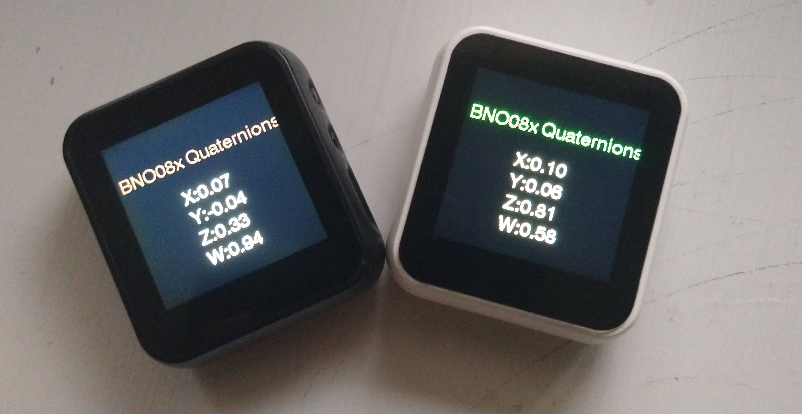
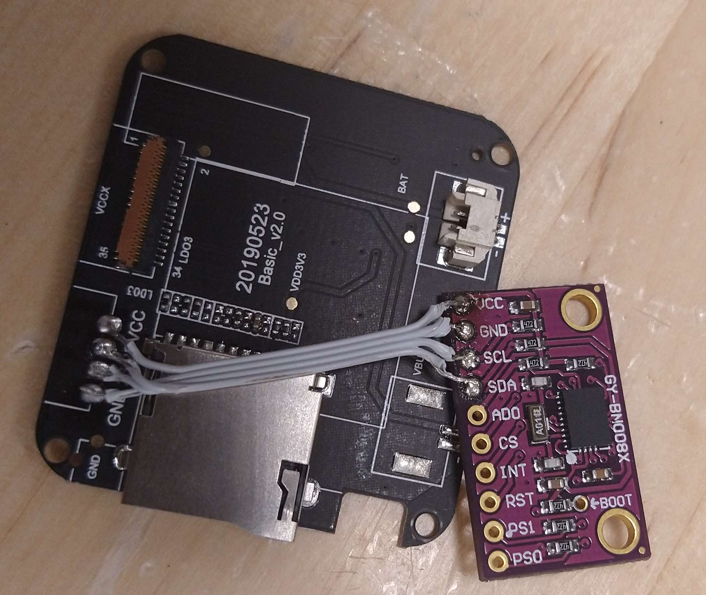
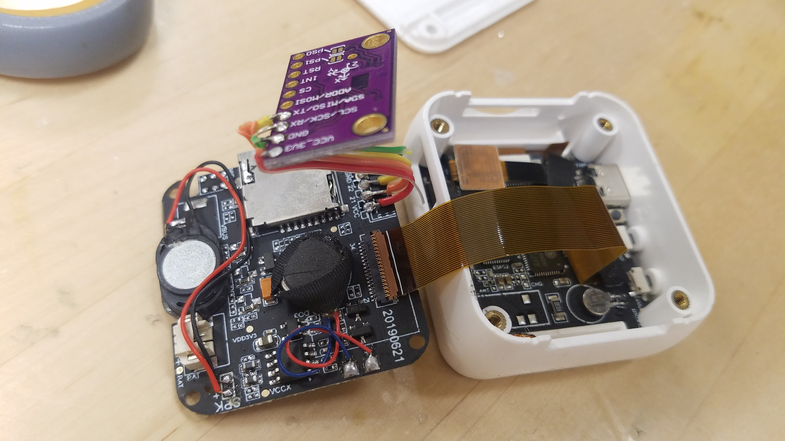

# T-Watch + bno085 === Wearable IoT IMU

A simple project that fuses T-watch with bno08x

## Hardware

### Requirements
- TTGO T-watch (https://www.aliexpress.com/item/1005001581849024.html; https://www.amazon.com/LILYGO-GPS-Lora-Programmable-Environmental/dp/B07ZWXV5FQ)
- bno08x (https://www.aliexpress.com/item/4000263329804.html; https://www.amazon.com/Taidacent-Nine-axis-High-Precision-Accelerometer-Magnetometer/dp/B0836WJLVH/)
- wires
- soldering equipment 

Solder the bno08x chip to the TTGO T-watch baseplate (I2C connectivity). Test connectivity using the [Test Code](https://github.com/tejaswigowda/t-watch-bno085/blob/main/i2cAddr/i2cAddr.ino) (change pin numbers if necessary).

If everything goes right you should have the quaternion output over the serial port. You can test using [Webserial here](https://tejaswigowda.com/webserial-imu-debug/).

